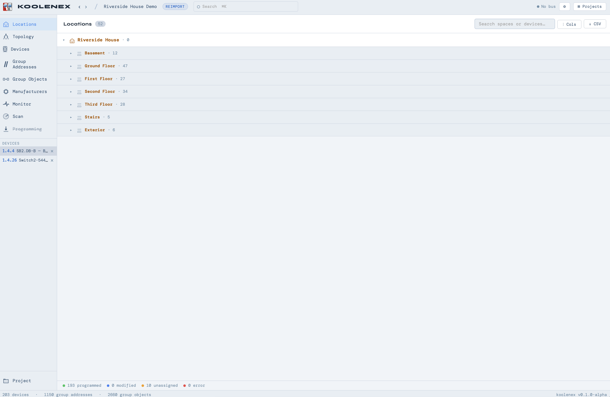
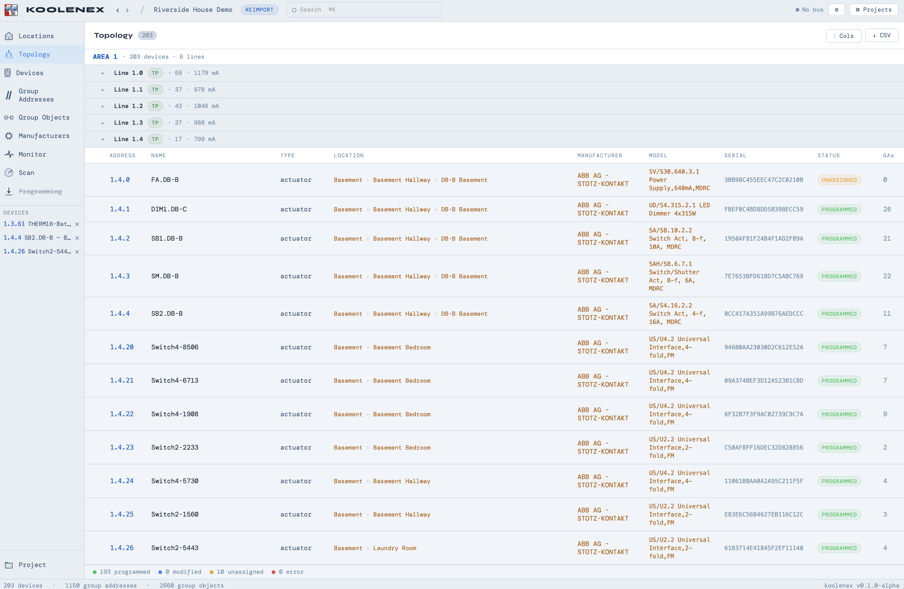
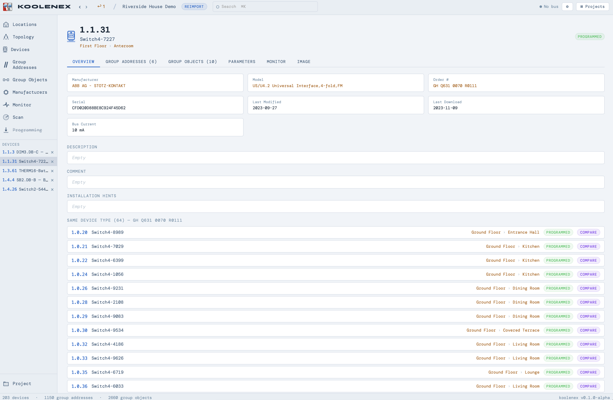
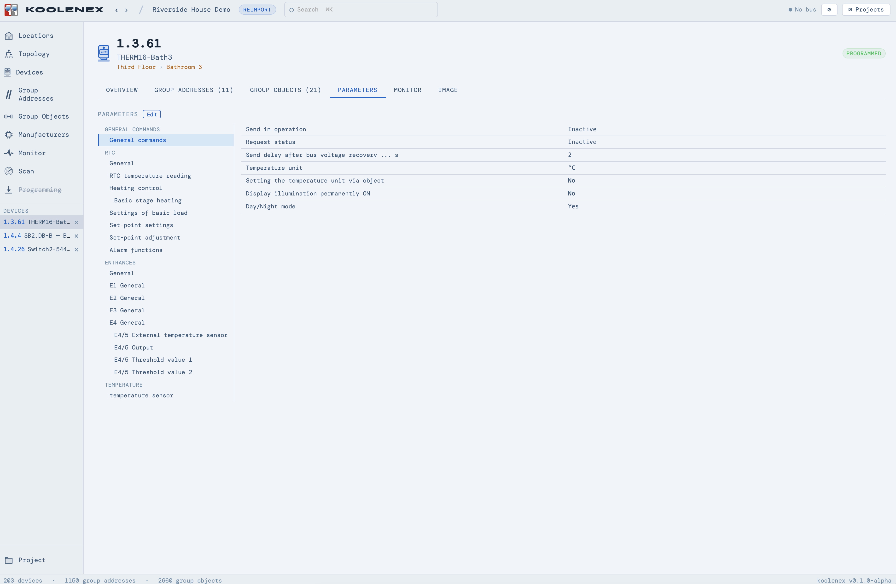
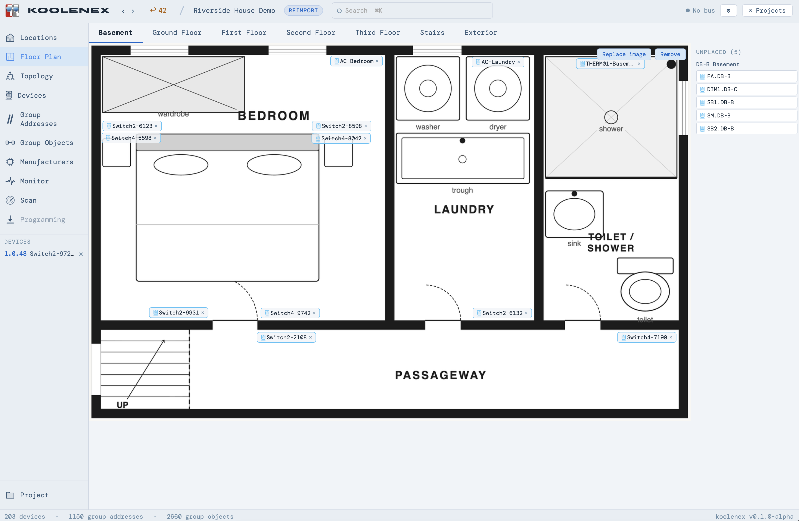
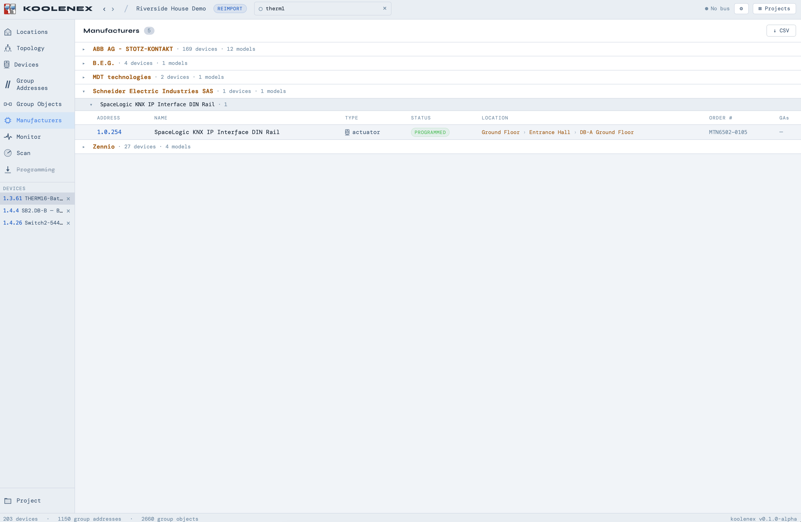

<p align="center">
  
</p>

# koolenex

Open-source KNX project tool. Import `.knxproj` files from ETS6,
manage your installation, and interact with a live KNX bus.

DISCLAIMER: THIS IS HIGHLY EXPERIMENTAL. PROBABLY FULL OF
BUGS. PROBABLY FAILS HORRIBLY ON YOUR KNXPROJ FILE. PROCEED WITH
CAUTION. DON'T USE FOR ANY REAL KNX PROJECT. CONNECTIONS WITH BUS
MONITOR ARE NOT GUARANTEED TO WORK CORRECTLY. ANYTHING COULD HAPPEN.

PROCEED AT YOUR OWN RISK.

## Features

- **Project import** — parse ETS6 `.knxproj` files including password-protected projects
- **Locations** — browse your building structure (floors, rooms, distribution boards)
- **Topology** — view areas, lines, and devices in their physical layout
- **Devices** — search, filter, sort, and edit devices; view parameters, group objects, and linked group addresses
- **Group Addresses** — tree and flat views with DPT display, linked device counts, and inline creation
- **Group Objects** — browse communication objects across all devices
- **Manufacturers** — devices grouped by manufacturer and model
- **Bus Monitor** — live telegram feed with decoded values, flow diagrams, and CSV export
- **Bus Scan** — discover devices on the KNX bus
- **Settings** — theme (dark/light), DPT display format (numeric/formal/friendly), language
- **Editable fields** — click-to-edit names, descriptions, comments, and installation hints with RTF rendering
- **CSV export** — export devices, group addresses, group objects, topology, locations, and manufacturers
- **Floor Plan** — upload floor plan images for each floor and drag devices onto them to visualize your installation layout
- **Undo/redo** — Ctrl+Z to undo edits
- **Global search** — find devices, group addresses, manufacturers, and models

## Screenshots

### Locations

The building view shows your KNX installation organized by floors and
rooms, matching the structure defined in ETS6. Expand any floor to see
the devices assigned to each space.



### Topology

Devices displayed in their physical bus topology — areas, lines, and
individual addresses. Shows manufacturer, model, serial number,
location, and programming status at a glance.



### Device Detail

Click any device to open its detail panel. The overview tab shows
device metadata, editable description/comment/installation hints
fields, and lists all other devices of the same type for quick
comparison.



### Device Parameters

View and edit device parameters organized by channel, exactly as they
appear in ETS6. The parameter tree on the left mirrors the ETS
parameter page structure.



### Device Comparison

Select two devices of the same type and compare their parameters side
by side. Differences are highlighted, making it easy to spot
configuration mismatches. The comparison also covers group objects and
linked group addresses.

.png)


### Connection Diagram

A visual map showing how a device connects to the rest of the
installation through its group addresses. Each group address fans out
to the other devices that share it, revealing the communication
topology.


### Live Connection Diagram

Watch telegrams flow through the connection diagram in real time. As
devices communicate, animated dots trace the path from sender through
the group address to all receivers, with speech bubbles showing the
decoded value.


### Bus Monitor

Live telegram feed from the KNX bus with DPT-aware decoding,
source/destination resolution, and device location display. The
timeline at the bottom shows telegram flow between devices. Supports
filtering, read/write operations, and CSV export.


### Per-Device Monitor

Each device detail panel has its own monitor tab showing only the
telegrams relevant to that device, filtered from the live bus feed.


### Per-Group Address Monitor

Group addresses also have a dedicated monitor tab, showing every
telegram sent to that address with decoded values and source device
information.


### Floor Plan

Upload a floor plan image for each floor and drag devices from the
sidebar onto their physical locations. Device positions are saved and
persist across sessions. Tabs at the top switch between floors.



### Manufacturers

Devices grouped by manufacturer and model. Expand any model to see all
instances in the installation with their addresses, locations, and
status.



### Universal Search

Search across devices, group addresses, manufacturers, and models from
anywhere in the app. Results are grouped by type and clicking any
result navigates directly to it.


## Requirements

- Node.js 18+

No native compilation needed — all dependencies are pure JavaScript.

## Setup

```bash
# Install server dependencies
npm install

# Install frontend dependencies
cd client && npm install && cd ..
```

## Running (development)

Open two terminals:

```bash
# Terminal 1 — backend API on :4000
npm start

# Terminal 2 — frontend dev server on :5173
cd client && npx vite
```

Then open **http://localhost:5173**

## Running (production)

```bash
cd client && npm run build && cd ..
npm start
# Open http://localhost:4000
```

## KNX Bus Connection

Enter your KNXnet/IP gateway address in **Settings**. Koolenex uses
its own KNXnet/IP implementation with no external dependencies.

## Disclaimer

Koolenex is an experimental tool for exploring and monitoring KNX
installations. It is very much under active development and has only
been tested against two real-world `.knxproj` files — there are almost
certainly incompatibilities with other projects, device types, and ETS
configurations.

## Stack

| | |
|---|---|
| Frontend | React 18 + Vite |
| Backend | Node.js + Express |
| Database | SQLite via sql.js (in-memory, persisted to `koolenex.db`) |
| Real-time | WebSocket |
| Protocol | KNXnet/IP |

## Project Structure

```
server/
  index.js          — Express server, WebSocket setup
  routes.js         — REST API endpoints
  db.js             — SQLite database layer
  ets-parser.js     — .knxproj file parser
  knx-bus.js        — KNX bus connection manager
  knx-protocol.js   — KNXnet/IP protocol implementation
client/
  src/
    App.jsx         — main app shell, sidebar, routing
    views/          — top-level views (Devices, GAs, Topology, etc.)
    detail/         — pinned detail panels (device, GA, compare)
    rtf.jsx         — RTF-to-HTML rendering
    dpt.js          — DPT info, formatting, and i18n
    api.js          — REST API client
    state.js        — app state management
```
